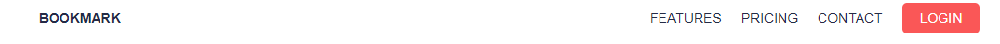
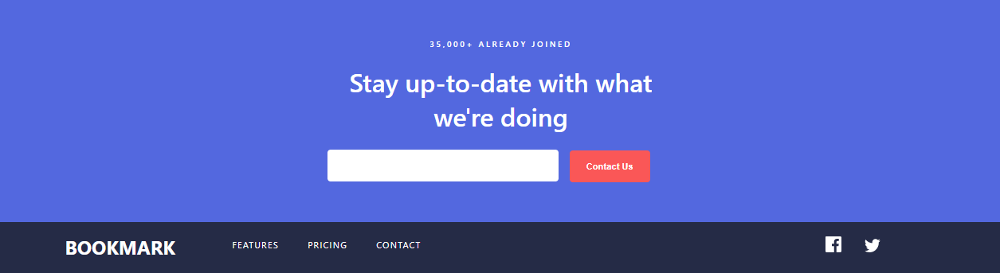

Components Project
    This projects contains different micro components that make up a basic website, such as navbars, footers, contact forms etc.

List of Components
1.  Navbar: navbar1. 
        used the design from frontendmentor bookmark landing page for the navbar component
        

2.  Navbar: navbar2.
        used the navbar design from frontendmentor manage landing page for the navbar component
        

3.  Banner: heroimage1.
        this is a hero image (banner) from frontendmentor manage landing page for the banner component
        

4.  Banner: heroimage2.
        this is the main banner from frontendmentor bookmark landing page to be used for the banner component
        

5.  Footer: footer1.
        this is the footer section from frontendmentor bookmark landing page, recreated for the footer component.
        

6.  Footer: footer2.
        this is the footer section from frontendmentor manage landing page, recreated for the footer component.
        

7.  Download: downloadSection1.
        this is the download section from frontendmentor bookmark landing page, recreated for the download component
        

8.  ArticleLayout: articleLayout1.
        this is the first article section from frontendmentor insure landing page, recreated for the article component
        

9.  Feature: feature1.
        this is the feature section from frontendmentor easybank landing page, recreated for the feature component.
        

10. ArticleLayout: articleLayout2.
        this is the second article section from frontendmentor easybank landing page, recreated for the article component.
        

11. Login
        this is a login user interface gotten from UI daily website.
        

12. SignUp
        this isa signup user interface gotten from UI daily website.
        
